# 🏗️ System Architecture

## 📋 Overview

The Audio Sentiment Analysis System is a comprehensive pipeline that processes audio files to extract customer sentiment insights. The system follows a modular, microservices-inspired architecture with clear separation of concerns.

## 🎯 System Goals

- **Scalability**: Handle multiple concurrent audio processing requests
- **Reliability**: Robust error handling and data persistence
- **Performance**: Optimized processing pipeline with caching
- **Extensibility**: Modular design for easy feature additions
- **User Experience**: Intuitive API and web dashboard

## 🏛️ High-Level Architecture

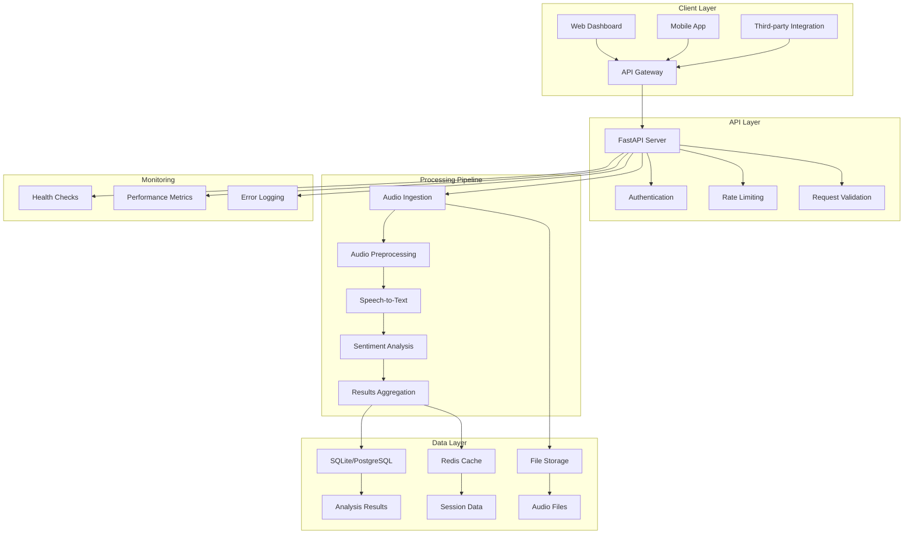

## 🔄 Processing Pipeline Architecture

```mermaid
flowchart LR
    subgraph "Input"
        A1[WAV/MP3/FLAC Audio] --> A2[File Validation]
        A2 --> A3[Size Check]
    end
    
    subgraph "Stage 1: Audio Preprocessing"
        B1[Load Audio] --> B2[Sample Rate Normalization]
        B2 --> B3[Channel Conversion]
        B3 --> B4[Noise Reduction]
        B4 --> B5[Silence Trimming]
        B5 --> B6[Amplitude Normalization]
    end
    
    subgraph "Stage 2: Transcription"
        C1[Whisper Model] --> C2[Speech Recognition]
        C2 --> C3[Language Detection]
        C3 --> C4[Confidence Scoring]
        C4 --> C5[Segment Extraction]
    end
    
    subgraph "Stage 3: Sentiment Analysis"
        D1[Hugging Face Model] --> D2[Transformer Analysis]
        D3[VADER] --> D4[Rule-based Analysis]
        D5[TextBlob] --> D6[ML-based Analysis]
        D2 --> D7[Ensemble Aggregation]
        D4 --> D7
        D6 --> D7
        D7 --> D8[Confidence Calculation]
    end
    
    subgraph "Stage 4: Postprocessing"
        E1[Results Aggregation] --> E2[Segment Analysis]
        E2 --> E3[Summary Generation]
        E3 --> E4[Database Storage]
    end
    
    A3 --> B1
    B6 --> C1
    C5 --> D1
    C5 --> D3
    C5 --> D5
    D8 --> E1
    E4 --> F1[API Response]
    E4 --> F2[Dashboard Update]
```

## 🗄️ Data Architecture

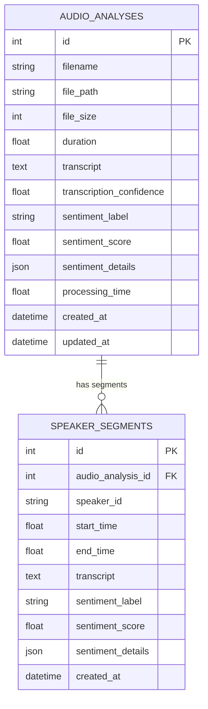

## 🏢 Component Architecture

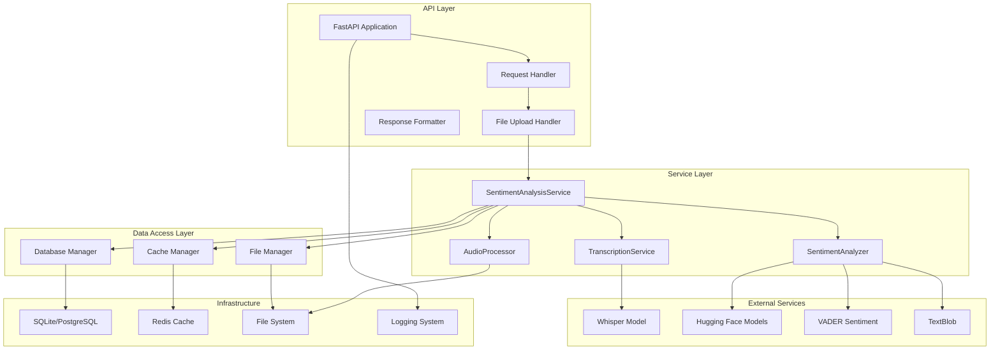

## 🔐 Security Architecture

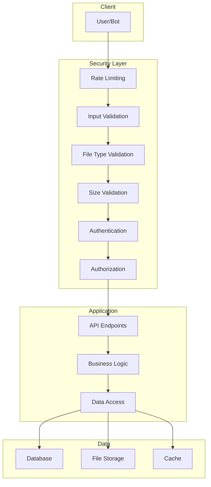

## 📊 Monitoring & Observability

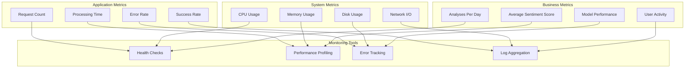

## 🚀 Deployment Architecture

### Development Environment

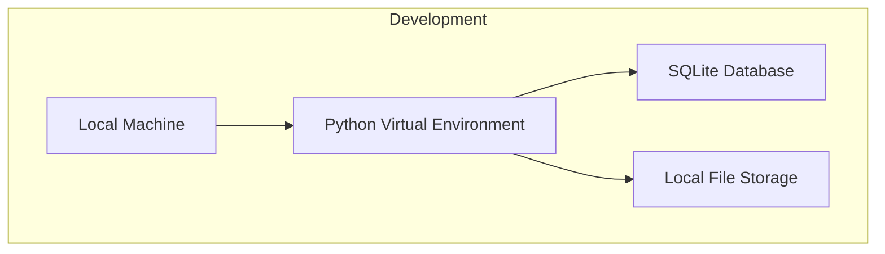

### Docker Environment

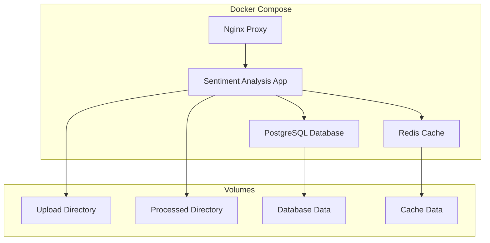

### Production Environment

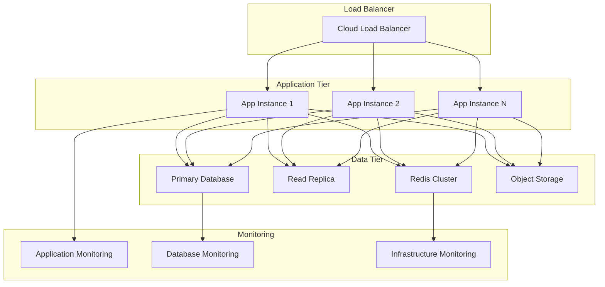

## 🔄 Data Flow Architecture

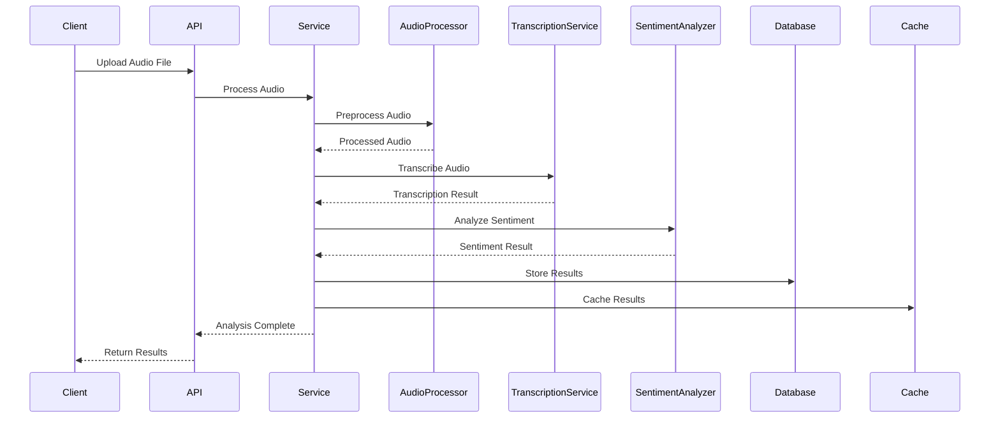

## 🎯 Performance Architecture

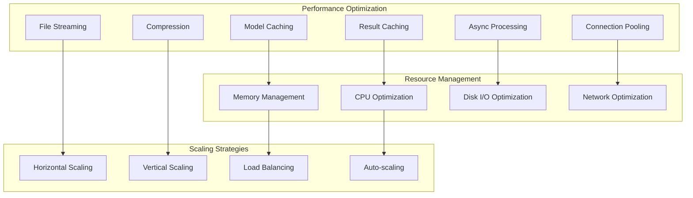

## 🔧 Configuration Architecture

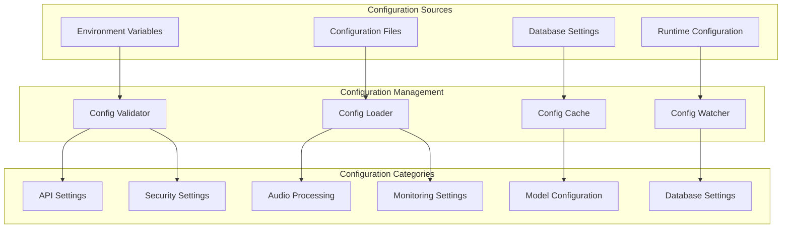

## 🛡️ Error Handling Architecture

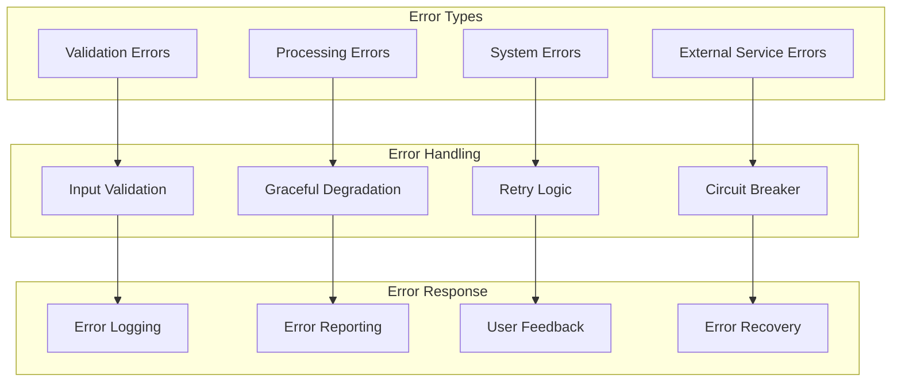

## 📈 Scalability Architecture

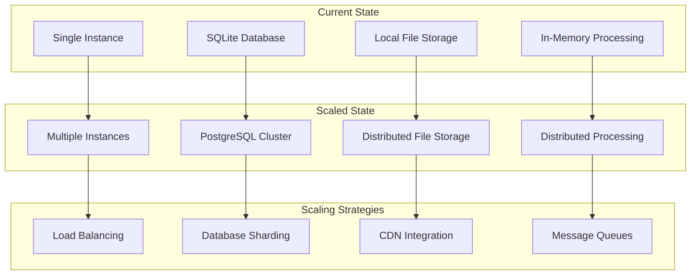

## 🔄 API Architecture

```mermaid
graph TB
    subgraph "API Endpoints"
        A[POST /analyze]
        B[GET /analyses]
        C[GET /analyses/{id}]
        D[GET /statistics]
        E[GET /status]
        F[DELETE /analyses/{id}]
        G[GET /health]
    end
    
    subgraph "Request Flow"
        H[Authentication]
        I[Validation]
        J[Processing]
        K[Response]
    end
    
    subgraph "Response Types"
        L[JSON Response]
        M[File Download]
        N[Streaming Response]
        O[Error Response]
    end
    
    A --> H
    B --> I
    C --> J
    D --> K
    E --> L
    F --> M
    G --> N
    H --> O
```

## 🎨 Dashboard Architecture

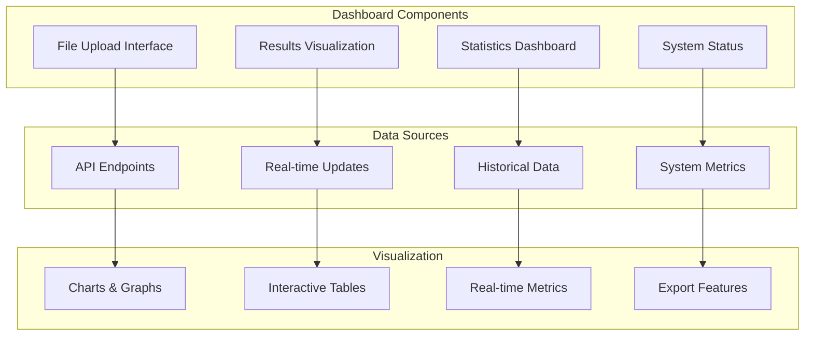

## 🔮 Future Architecture Extensions

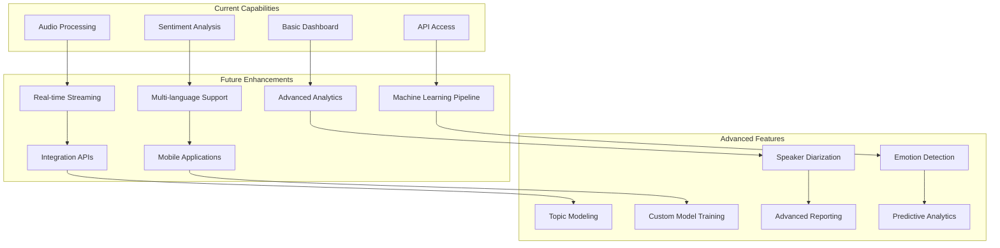

## 📋 Architecture Principles

### 1. **Modularity**
- Each component has a single responsibility
- Clear interfaces between modules
- Easy to test and maintain

### 2. **Scalability**
- Horizontal scaling support
- Stateless design where possible
- Efficient resource utilization

### 3. **Reliability**
- Comprehensive error handling
- Data persistence and backup
- Health monitoring and alerting

### 4. **Security**
- Input validation and sanitization
- Authentication and authorization
- Secure data transmission and storage

### 5. **Performance**
- Caching strategies
- Optimized algorithms
- Resource management

### 6. **Maintainability**
- Clear documentation
- Consistent coding standards
- Comprehensive testing

## 🎯 Technology Stack

### **Backend**
- **Python 3.12**: Core programming language
- **FastAPI**: Modern, fast web framework
- **SQLAlchemy**: Database ORM
- **Pydantic**: Data validation

### **Audio Processing**
- **Librosa**: Audio analysis and processing
- **SoundFile**: Audio file I/O
- **NoiseReduce**: Audio denoising
- **FFmpeg**: Audio format conversion

### **Machine Learning**
- **OpenAI Whisper**: Speech-to-text
- **Hugging Face Transformers**: Sentiment analysis
- **VADER**: Rule-based sentiment analysis
- **TextBlob**: Text processing and sentiment

### **Frontend**
- **Streamlit**: Web dashboard
- **Plotly**: Interactive visualizations
- **Pandas**: Data manipulation

### **Infrastructure**
- **Docker**: Containerization
- **PostgreSQL**: Production database
- **Redis**: Caching and sessions
- **Nginx**: Reverse proxy

### **Monitoring**
- **Health Checks**: System monitoring
- **Logging**: Application logs
- **Metrics**: Performance tracking

This architecture provides a solid foundation for a production-ready sentiment analysis system that can scale with business needs while maintaining high performance and reliability. 